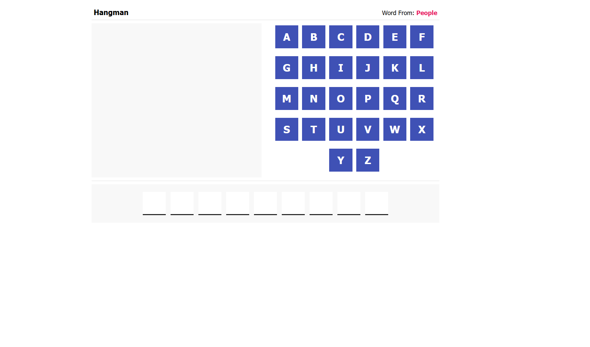
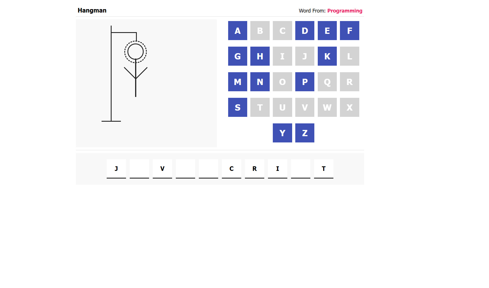
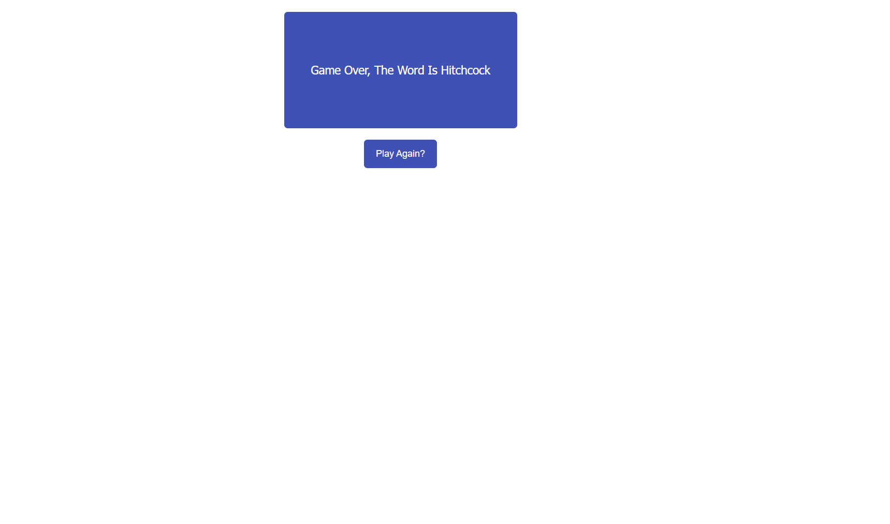

# 🎮 Hangman Game

> A classic word-guessing game built from scratch with Vanilla JavaScript and CSS shapes.

## 📖 Project Overview

This is a frontend practice project recreating the classic **Hangman** game. It demonstrates advanced DOM manipulation, algorithmic logic, game state management, and creative use of raw CSS to draw complex shapes. The game features multiple categories, an interactive on-screen keyboard, and dynamically generated game spaces.

## ✨ Features

- **Categorized Word Library:** Words are categorized into domains like Programming, People, Countries, and Fighters.
- **Dynamic Keyboard:** The on-screen keyboard is generated dynamically using JavaScript arrays.
- **Pure CSS Drawing:** The Hangman figure (stand, rope, head, body, hands, legs) is drawn step-by-step strictly using CSS shapes and `display` toggling – no images, Canvas, or SVGs are used!
- **Game State Management:** Accurately tracks wrong attempts against a maximum limit and correctly validates win conditions.
- **Interactive UI:** Clickable on-screen letters that disable upon clicking to prevent redundant inputs.

## 📸 Screenshots & Demo

## 🌐 Live Demo 👉 hhangman-game.netlify.app

| Main Interface | Hangman Draw | Game Over Screen | Win Screen |
|----------------|-------------|-----------|-----|
|  |  |  |  |

## 🛠 Tech Stack & Tools

- **HTML5:** Semantic structure.
- **CSS3:** Advanced styling, absolute positioning, pseudo-elements, and CSS geometries for the Hangman drawing.
- **JavaScript (Vanilla/ES6):** Game loop, event delegation, array manipulations, and DOM node generation.

## ⚙️ Architecture & System Design

The game flow relies on data structures and procedural logic:
1. **Data Layer:** A dictionary-style object `words` holds categories as keys and arrays of strings as values.
2. **Initialization:** A random category and word are selected using `Math.random()`. The word is split to generate empty `.space` and letter spans in the DOM.
3. **Event Loop:** An event listener is attached to the parent container of the keyboard utilizing **Event Delegation** for optimized performance.
4. **Validation Logic:** Checks the clicked letter against the target word array. If correct, the UI updates; if wrong, a counter increments and triggers the display of the next static CSS drawing node via an ordered array `drawParts`.

## 🚀 Installation & Setup

No boilerplate setup or package installation is required.

1. Clone the repository:
   ```bash
   git clone https://github.com/yassenahmed77/hangman-js.git
   ```
2. Navigate to the project directory:
   ```bash
   cd hangman-js
   ```

## 💻 How to Run Locally

1. Open the `index.html` file in any modern web browser.
2. Or use the **Live Server** extension in VS Code.

## 📘 Usage Guide

1. Upon loading the page, check the hint at the top right to see the category (e.g., `Word From: Programming`).
2. Click the letters on the screen to guess the characters in the hidden word.
3. Correct letters will appear in their respective empty spaces below.
4. Incorrect letters will progressively draw a piece of the Hangman.
5. Guess the full word before the man is fully drawn to win! Click "Play Again?" when the game ends.

## 📁 Folder Structure

```text
📁 Hangman/
├── 📄 index.html      # Main HTML layout
├── 📄 master.css      # Layout, variables, and pure CSS drawings
├── 📄 main.js         # Core Game Logic
└── 📄 README.md       # Project documentation
```

## 🤝 Contribution Guidelines

This is an individual practice project focused on Vanilla JS logic. Feel free to explore the code, fork it, or submit Pull Requests for UI improvements.

## 📞 Author

**Yassen Ahmed**
- GitHub: [@yassenahmed77](https://github.com/yassenahmed77)
